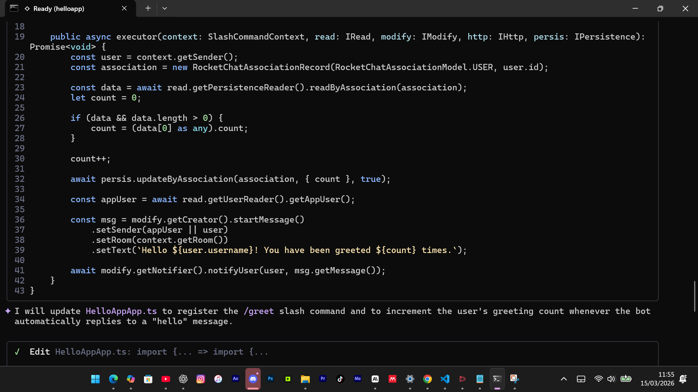
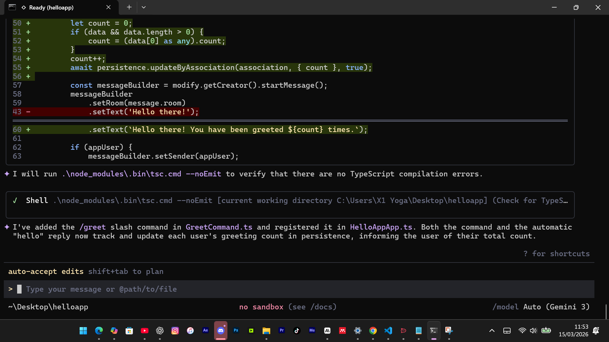

# RC-apps-research
Systematic research journal for GSoC this installment in particular the Rocket.Chat AI Apps Generator
#  My GSoC Research Journal
## Rocket.Chat — AI Apps Generator 

This is my personal research log for the GSoC 2026 AI Rocket.Chat 
Apps Generator project. I'm using this to track everything I learn, 
every experiment I run, and every decision I make during my whole process of doing this project.

---

## March 12, 2026 — Getting Oriented

I found out about this project and spent the day reading through 
everything I could find. Read the full project description, went 
through the entire channel history, and tried to understand what 
had already been attempted before jumping in.

The channel history alone took a while to get through. A lot of 
people had already tried building things from scratch and got 
redirected by the mentor. That told me something important — this 
project is not about building a new CLI tool. It's about extending 
what already exists and making it understand Rocket.Chat.

The most interesting thing I read was Khizar's experiment where 
Gemini created a greeting bot that ended up in an infinite loop. 
The intent was completely clear but Gemini had no idea that message 
listeners in RC fire for bot messages too. That one example made the 
whole problem click for me. This is not a prompt engineering problem. 
It's a missing knowledge problem.

---

## March 13, 2026 — Understanding The Problem Deeply

Spent this day mapping out the key discussions from the channel and 
what each one revealed about the actual problem:

Khizar's infinite loop experiment showed that Gemini generates 
technically valid code that violates RC-specific rules it doesn't 
know about. The fix isn't a better prompt ...it's baking those rules 
into the context Gemini always has access to.

Meet's token cost analysis showed that loading the entire RC context 
on every iteration is expensive and slow. The GEMINI.md file can't 
just be a dump of everything RC. It needs to be lean and targeted.

Dnouv's clarification about the project scope made it clear the tool 
needs to work for slightly technical users with almost zero knowledge 
of app development. That means the system needs to translate plain 
English into the right RC patterns automatically.

Soroush raised something I hadn't considered .... what if the generated 
app has silent correctness failures? The infinite loop is obvious but 
there could be subtler bugs. Some kind of validation step before 
the final code is handed to the user would make the tool much more 
trustworthy.

By the end of this day I had a clearer picture of what the project 
actually needs. Not just a knowledge file ...a structured system with 
safety rules, feature routing, and basic validation working together.

---

## March 14, 2026 — Setting Up The Environment

Set up the development environment from scratch. Installed Node.js 
v20 specifically ... someone in the channel had warned against v24 
due to packaging errors and I wanted to avoid that from the start.

Installed the RC Apps CLI and ran rc-apps create to generate my 
first HelloApp skeleton. Looked through every file it generated. 
The main app file HelloAppApp.ts is essentially an empty shell that 
extends the RC App blueprint and does nothing until you add handlers. 
Looking at that file as a non-technical user would be completely 
confusing.Due to the fact there's no indication of what to add or where. That 
firsthand experience made the problem feel very real.

Also cloned the Gemini CLI repository and started navigating the 
codebase. Found the commands folder and read through the source 
files to understand how commands and context are structured.

---

## March 15, 2026 — First Pull Requests

Submitted two pull requests to the Gemini CLI repository today.

The first one fixed hardcoded /resume references in chatCommand.ts. 
The file had usage strings that still said /resume even though the 
command had been renamed to /chat. The fix replaced the hardcoded 
strings with context.invocation?.name so the message dynamically 
uses whatever command the user actually typed. Going through the 
review process and responding to maintainer feedback taught me a 
lot about how the command context object works in Gemini CLI .....
which is directly relevant to how RC-specific commands will be 
registered and invoked on top of it.

The second one documented how authentication method affects which 
model variants are available. The docs had no mention of the fact 
that gemini-3.1-pro-preview-customtools is only available to users 
authenticating via Gemini API Key. I updated four documentation 
files to make this clear. Beyond the documentation fix itself, 
reading through the codebase to understand the auth gating logic 
gave me a clearer picture of how model selection works internally.

Both PRs are currently under review.

---

## What I Am Working Toward

The core idea I want to prototype is a layered knowledge system 
for the RC Apps Generator. Rather than one large GEMINI.md file 
that loads everything, the system would have two layers. The first 
layer is a small set of safety rules that always load. things like 
never firing on bot messages without checking sender type. The 
second layer is a feature map that routes user intent to specific 
RC interface definitions only when relevant  so if someone says 
save data the system loads the Persistence API definitions, not 
the entire Apps Engine type library.

This approach keeps token usage lean for simple apps while giving 
Gemini full context for complex ones.

---

## Next Steps
- [ ] Understand the Gemini CLI extension and skills system
- [ ] Study how GEMINI.md files are loaded and processed
- [ ] Build a basic GEMINI.md prototype with RC safety rules
- [ ] Run experiment: can Gemini generate a working RC app
      with and without RC-specific context?
- [ ] Map the full keyword → RC feature translation layer

## March 15, 2026 — Day 4: Understanding The Extension System
And Building The First Prototype

### What I Learned

Spent today going deep on how Gemini CLI extensions actually
work. Read through the official extension documentation and
the architecture clicked into place.

An extension has four key parts. The gemini-extension.json
is the identity card that tells Gemini CLI what the extension
is called and which files to load. The GEMINI.md is the brain
that gets injected into every session automatically .... this is
where safety rules and RC architecture knowledge live. Skills
are specialized knowledge bundles that only activate when the
user's intent matches .... this is the clean solution to the
token cost problem essentially. Custom commands are shortcuts that give
non-technical users a simple entry point without needing to
know RC internals.

The skills architecture is particularly important. Instead of
loading everything RC into one large context file, each RC
feature gets its own skill. The slash command skill only loads
when someone asks for a slash command. The persistence skill
only loads when someone asks to save data. This keeps token
usage lean for simple apps while giving Gemini full context
for complex ones.

### What I Built

Built the first working skeleton of the RC Apps Generator
extension. The structure looks like this:

rc-apps-generator/
    gemini-extension.json
    GEMINI.md
    skills/
        slash-command/SKILL.md
        message-listener/SKILL.md
    commands/
        rc/new.toml

The GEMINI.md contains five critical safety rules that always
load ....including the bot message check that prevents Khizar's
infinite loop bug. The message listener skill has this check
baked in by default so it becomes impossible to miss.

The slash command skill contains the exact RC interface
structure Gemini needs to generate correct code ... including
the registration step inside extendConfiguration that most
generated code misses.

### Key Technical Decision

I chose a layered approach deliberately. Safety rules live in
GEMINI.md and always load. Feature specific knowledge lives in
skills and loads only when needed. This means a user asking
for a simple slash command never pays the token cost of
loading persistence or UIKit knowledge they don't need.

### Prototype Live On GitHub
https://github.com/NestroyMusoke/RC-apps-generator

## Controlled Experiment

### Experiment Setup

Ran Gemini CLI on a fresh RC app with zero RC-specific context.
Tested the same scenario Khizar described in the channel...
a bot that greets hello messages ... then extended it to include
a slash command with persistence.

### Experiment 1 — Simple Message Listener

Prompt: "Make a bot that greets every hello message"

Gemini 3 correctly used IPostMessageSent, added a bot message
check using getAppUser() comparison, and compiled without errors.
This is more capable than the version Khizar tested with in early
March — the obvious infinite loop bug no longer reproduces on
Gemini 3 for simple cases.

### Experiment 2 — Slash Command With Persistence

Prompt: "Add a slash command called /greet that saves how many
times each user has been greeted and shows them their count"

Gemini correctly used ISlashCommand, RocketChatAssociationRecord,
and registered the command in extendConfiguration. The code
compiled with zero errors. However it introduced a silent runtime
bug — it called msg.getMessage() on a builder that was never
finished with .finish(). In RC Apps Engine this means the message
is built but never actually sent. No error is thrown. A
non-technical user would have no idea why their command produces
no output.

### Evidence Screenshots

Compilation passed with zero errors — making the silent bug invisible:

The silent bug — message built but never finished with .finish():

Full generated slash command code from Gemini 3:

### Session Stats

- [ ] Tool calls: 17
- [ ] Code added: 107 lines
- [ ] Total time: 31 minutes
- [ ] Tokens used: 185,000+ total
- [ ] Cached tokens: 143,628 (74.6% savings from caching)
( This benchmark is relevant to the Token Cost Problem that MEET raised in the communications channel)

### Key Finding

The problem is not compilation errors. The problem is silent
runtime failures caused by RC-specific patterns that sit between
technically valid code and actually working code. The .finish()
requirement is not enforced by TypeScript. The correct persistence
data shape is not documented in types. These are invisible patterns
that only exist in RC documentation and community knowledge.
Generally Gemini 3 gets about 80 percent of complex RC apps right
without any RC context. The remaining 20 percent fails silently.

### Why This Matters

This finding reframes the entire project. The RC Apps Generator
extension is not about fixing compilation errors ... Gemini 3
already handles those well. It is about ensuring encoding the invisible
RC-specific patterns that sit between valid code and working code.
That is a more precise and more valuable problem to solve.

### Updated Extension

Added the .finish() pattern explicitly to the slash command skill
so Gemini always knows to call modify.getCreator().finish()
after building any message. This makes the invisible visible.

Prototype repo: https://github.com/NestroyMusoke/RC-apps-generator

## March 16, 2026 — RC App Challenge Completed

Spent the entire day building and deploying the RC App Challenge from scratch with no AI assistance. The challenge required building a mention monitoring app with:
- Slash command `/nestroymusoke on|off` with persistence
- Ephemeral notifications to the sender when they mention @Nestroy2003
- External Logger setting — POST to a configurable URL and display the result

Hit every bug in the book during this process. Most significant findings:

**Finding 1 — IPostMessageSent registration:**
`configuration.messages` does not exist on `IConfigurationExtend`. The listener must be implemented directly on the main App class using `implements IPostMessageSent`. Without this declaration the listener deploys, enables, and silently never fires. Filed as GitHub Issue #39664 on the RC Apps Engine repo. Confirmed by RC maintainer d-gubert.

**Finding 2 — Ephemeral message builder:**
`modify.getCreator()` builds public channel messages. For ephemeral messages, `read.getNotifier()` must be used. Using the wrong builder produces no error — the message is simply never delivered.

**Finding 3 — External HTTP response codes:**
The external logger endpoint returned HTTP 201 not 200. Code checking only for `statusCode === 200` silently fell back to the default message. Fixed by checking `response.data?.result` directly.

App passed Sing Li's final validation test on safe.dev.rocket.chat.

Repository: https://github.com/NestroyMusoke/RC-mention-monitor-app

---

## March 17–18, 2026 — Before/After Experiment (Day 6)

Ran the controlled experiment comparing Gemini output with and without the extension active.

**Same prompt given twice:**
"Create a Rocket.Chat app with a slash command /greet that sends Hello! to the channel, and a message listener that sends an ephemeral thank you message to anyone who mentions @testuser"

**Without extension — bugs found:**
- `modify.getNotifiers().notifyUser()` — method doesn't exist, silent failure
- `modify.getCreator().startMessage()` for ephemeral — wrong builder, message never delivered
- Missing bot sender check — infinite loop risk
- All three bugs compiled cleanly with zero TypeScript errors

**With extension — correct output:**
- `read.getNotifier()` used automatically
- `notifier.getMessageBuilder()` for ephemeral messages
- Bot check included automatically
- `implements IPostMessageSent` on the App class

Critical observation: The difference is not Gemini's capability. It is the presence or absence of RC-specific context. Without it, Gemini defaults to general TypeScript assumptions that conflict with RC's behavioral contracts.

---

## March 19, 2026 — Workspace Awareness Discovery

While debugging deployment failures discovered a second class of errors beyond silent runtime failures — workspace compatibility failures.

The RC server at localhost:3000 (RC 8.0.2) rejected a generated app ZIP because it contained a `.ts` file when the server expected pre-compiled `.js`. No useful error message. Only discovered by reading the Apps Engine definition files directly.

**Key insight:** The RC server exposes a public endpoint `GET /api/info` requiring no authentication. This returns the RC version. RC and the Apps Engine are co-released — the version alone is a deterministic proxy for the full environment.

Built a workspace probe script `rc-probe.js` that:
1. Queries `/api/info`
2. Resolves RC version against a built-in mapping table
3. Outputs full workspace profile — Apps Engine version, Node.js, MongoDB, packaging requirements

Tested against localhost:3000 and safe.dev.rocket.chat. Both probed successfully.

RC Version to Apps Engine mapping table sourced from: https://github.com/RocketChat/Rocket.Chat/releases

This closes the deployment failure class — the tool knows the target environment before generating anything.

Extension repo updated: https://github.com/NestroyMusoke/RC-apps-generator

## March 20-22, 2026 — Community Engagement and Cross-Project Collaboration

Active engagement in the RC GSoC 2026 community channel this period.

**Mohit Raj's validation script discussion:**
Mohit shared a prototype that catches common RC app bugs post-generation — missing `.finish()`, incorrect notifier usage, missing bot checks. Added to the discussion the finding about `implements IPostMessageSent` being required on the App class — without it the listener deploys and silently never fires. This is the most invisible of the silent failure class because everything appears to work until you actually test the app.

**Atharv Vedant — MCP Server integration:**
Atharv is building a Minimal MCP Server Generator as a separate GSoC project. Identified a natural integration point — RC apps have full outbound HTTP capability via `IHttp`. A generated RC app can connect to an MCP server as its backend, with the RC app serving as the conversational interface inside the chat. The `rc-http-outbound` skill already teaches the correct outbound HTTP patterns, meaning this integration requires no additional tooling.

**Khizar's preview feature:**
Khizar demonstrated a confirmation loop with a live chat preview before deployment — user describes app, Gemini shows a dummy chat preview of the expected behavior, user confirms, app deploys. Added the suggestion that the preview could also surface which RC interfaces are being used under the hood — making the tool educational, not just generative.

---

## March 22-25, 2026 — Proposal Architecture and Extension Updates

**RC-apps-generator repo changes:**

- `GEMINI.md` — Added Workspace Awareness Protocol section at the top. Includes RC version to Apps Engine mapping table sourced directly from GitHub releases. Added override framing guidelines for all skills.
- `skills/rc-message-listener/SKILL.md` — Completely rewrote. Removed incorrect `configuration.messages.providePostMessageSentHandler()` registration pattern. Added correct `implements IPostMessageSent` on App class pattern. Added `read.getNotifier()` vs `modify.getCreator()` distinction. Added bot sender type rejection — not just `type === 'bot'` but also app sender types.
- `skills/rc-persistence/SKILL.md` — New skill. Covers correct `RocketChatAssociationRecord` usage, `readByAssociation` not `getByAssociation`, upsert flag requirement, association model selection (USER vs ROOM vs MISC).
- `skills/rc-http/SKILL.md` — New skill. Covers outbound POST with correct headers, response handling that checks `response.data?.result` directly rather than assuming status 200, try/catch wrapping, never hardcoding URLs.
- `commands/rc/rc-probe.js` — New file. Workspace probe script that queries `/api/info`, resolves RC version against mapping table, outputs full workspace profile including Apps Engine version, Node.js, MongoDB, packaging requirements.
- `gemini-extension.json` — Updated to register new skills.

**Proposal architecture finalized:**

Five layer pipeline documented:
- Layer 0: Intent Clarification and Architectural Mapping
- Layer 1: Workspace Profiling
- Layer 2: Knowledge-Aware Code Generation
- Layer 3: Behavioural Verification Through Test Generation
- Layer 4: Workspace-Compatible Packaging

Added mutation testing protocol to Layer 3 — a liar check that programmatically introduces a functional mutation into generated code to verify test suite integrity before packaging.

Added benchmark suite to the timeline — six pillars covering architectural accuracy, environment alignment, build integrity, logical soundness, code quality, and deployment readiness. Runs at the end of every development iteration not just final submission.

---

## March 25-31, 2026 — Proposal Refinement and Extension Consolidation

**RC-apps-generator repo changes:**

- `skills/rc-message-listener/SKILL.md` — Added explicit rejection of app sender types alongside bot sender types. Corrected trigger description to match natural language patterns developers actually use.
- `skills/rc-http/SKILL.md` — Added sender ID fallback pattern for external logger response — if server returns no `id` field, fall back to `sender.id` rather than hardcoding `unknown`.
- `skills/rc-version-compat/SKILL.md` — New skill. Documents known API gaps between Apps Engine versions. Specifically documents the `configuration.messages` gap discovered during the RC challenge — this property never existed on `IConfigurationExtend` despite `IPostMessageSent` being defined in the definition files.
- `rc-probe.js` — Extended to show two-tier workspace awareness: public probe (no auth) vs authenticated probe (deeper environment details). Documents what each tier can and cannot access and why.
- `README.md` — Updated with full project description, installation instructions, skill authoring guide, and architecture overview.

**Research findings documented:**

The workspace awareness feature has two tiers. Tier 1 queries `/api/info` publicly — no authentication required, returns RC version which alone is sufficient to determine the full environment through the mapping table. Tier 2 requires admin authentication via `X-Auth-Token` and `X-User-Id` headers — returns Apps Engine version, framework settings, security policies directly. For most users Tier 1 is sufficient. Tier 2 is optional and respects RC's security model by never requesting credentials the user hasn't explicitly provided.

Discovered that deeper environment information sits behind authenticated endpoints — validated by querying `safe.dev.rocket.chat` with a personal access token. The `Apps_Framework_Version` setting returned a permissions error for non-admin users. This confirmed the Tier 1 design decision — the public RC version is the correct and sufficient proxy for the full environment.

**GitHub issue #39664:**
Filed on RocketChat/Rocket.Chat.Apps-engine documenting the `configuration.messages` missing from `IConfigurationExtend` in Apps Engine 1.60.0. Confirmed by RC maintainer d-gubert that `IPostMessageSent` must be implemented directly on the main App class. Issue informed the `rc-message-listener` skill rewrite and the `rc-version-compat` skill documentation.
